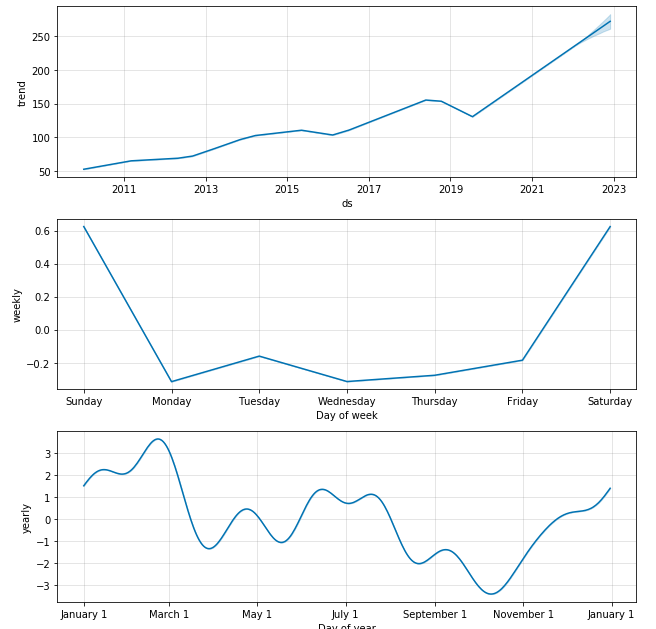

# KNN-Linear-Regression-Prophet-for-Stock-Price-Prediction
Machine Learning tool for stock price prediction by applying KNN, Linear Regression and Prophet.
I developed this tool mainly to gain more experience in time series analysis and object-oriented programming. I will occasionally update this project by adding more fuctions. Please do not use it for making investment or trading decision. 
# Requirements
* [Pandas](https://pandas.pydata.org)
* [Pandas-datareader](https://pandas-datareader.readthedocs.io/en/latest)
* [Datetime](https://docs.python.org/3/library/datetime.html)
* [Prophet](https://facebook.github.io/prophet/docs/installation.html#installation-in-python)
* [Matplotlib](https://matplotlib.org/stable/users/index.html)
* [Sklearn](https://scikit-learn.org/stable/user_guide.html)
* [Numpy](https://numpy.org/doc/stable/)
# Methods
The tool (Prodictors) includes 3 main methods for predicting analyzing stock prices. 
The data is generating from Yahoo Finance, up to 10 years of data for training (from 1/1/2010 to the most recent avaiable data). The default stat is Adjusted Closing and default start and end dates are the beginning and ending dates of the data.
# Examples
In this case, I will use IWM Which is the Russell 2000 ETF and see the price prediction by applying linear-regression / KNN / Prophet. 
```
from prodictors import Prodictors #import Prodictors
ticker = 'IWM'
test_ticker = Prodictors(ticker)
```

## Linear Regresion Stock Price Prediction
```
test_ticker.linear_prediction() 
```


## KNN Stock Price Prediction
```
test_ticker.knn_prediction()
```


## Prophet Stock Price Prediction
```
test_ticker.prophet_predict(days = 365)
```


## Prophet Seasonal trend
```
test_ticker.trend_analizer(days = 365)
```


