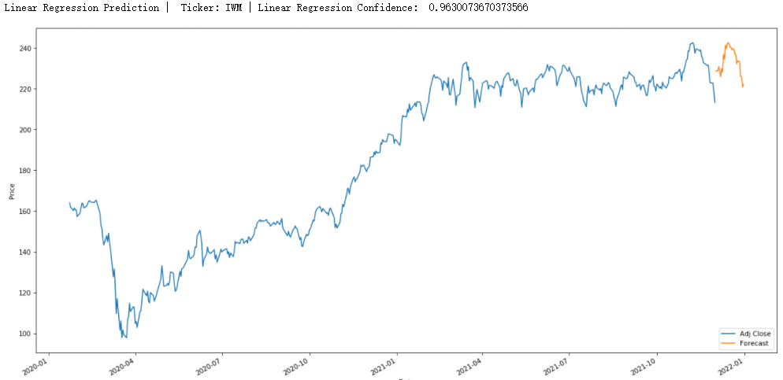
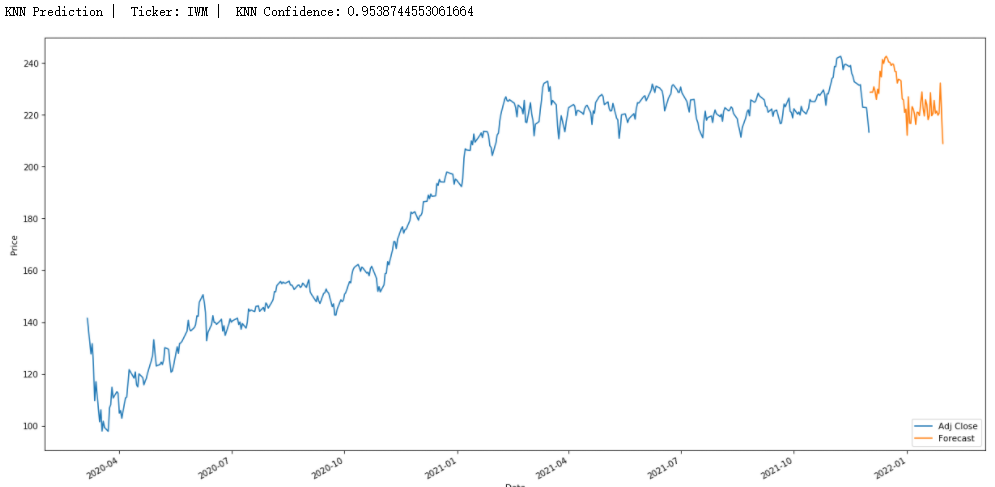
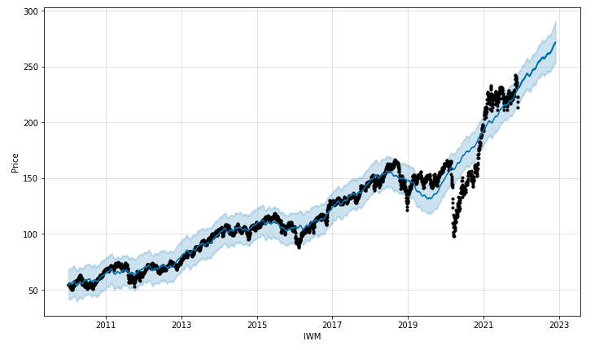

# KNN-Linear-Regression-Prophet-for-Stock-Price-Prediction (Prodictor)
Prodictor is a python base tool that I develop to gain more experience in Machine Learning for stock price prediction by applying KNN, Linear Regression and Prophet.I will occasionally update this project by adding more fuctions. Please do not use it for making investment or trading decision. 
# Requirements
* [Pandas](https://pandas.pydata.org)
* [Pandas-datareader](https://pandas-datareader.readthedocs.io/en/latest)
* [Datetime](https://docs.python.org/3/library/datetime.html)
* [Prophet](https://facebook.github.io/prophet/docs/installation.html#installation-in-python)
* [Matplotlib](https://matplotlib.org/stable/users/index.html)
* [Sklearn](https://scikit-learn.org/stable/user_guide.html)
* [Numpy](https://numpy.org/doc/stable/)
* [Math](https://docs.python.org/3/library/math.html)

# Methods
The tool (Prodictors) includes 3 main methods for predicting analyzing stock prices. 
The data is generating from Yahoo Finance, up to 10 years of data for training (from 1/1/2010 to the most recent avaiable data). The default statistics data is the adj close, and the default start and end dates are the start and end dates of the data.
# Examples
By applying linear-regression / KNN / Prophet. 
```
from prodictors import Prodictors #import Prodictors
ticker = 'IWM'
test_ticker = Prodictors(ticker)
```

## Linear Regresion Stock Price Prediction
```
test_ticker.linear_prediction() 
```


## KNN Stock Price Prediction
```
test_ticker.knn_prediction()
```


## Quadratic regression, PolynomiaFeatures, Degree = 2
```
test_ticker.quad_regression2()
```


## Quadratic regression, PolynomiaFeatures, Degree = 3
```
test_ticker.quad_regression3()
```


## Prophet Stock Price Prediction
```
test_ticker.prophet_predict(days = 365)
```


